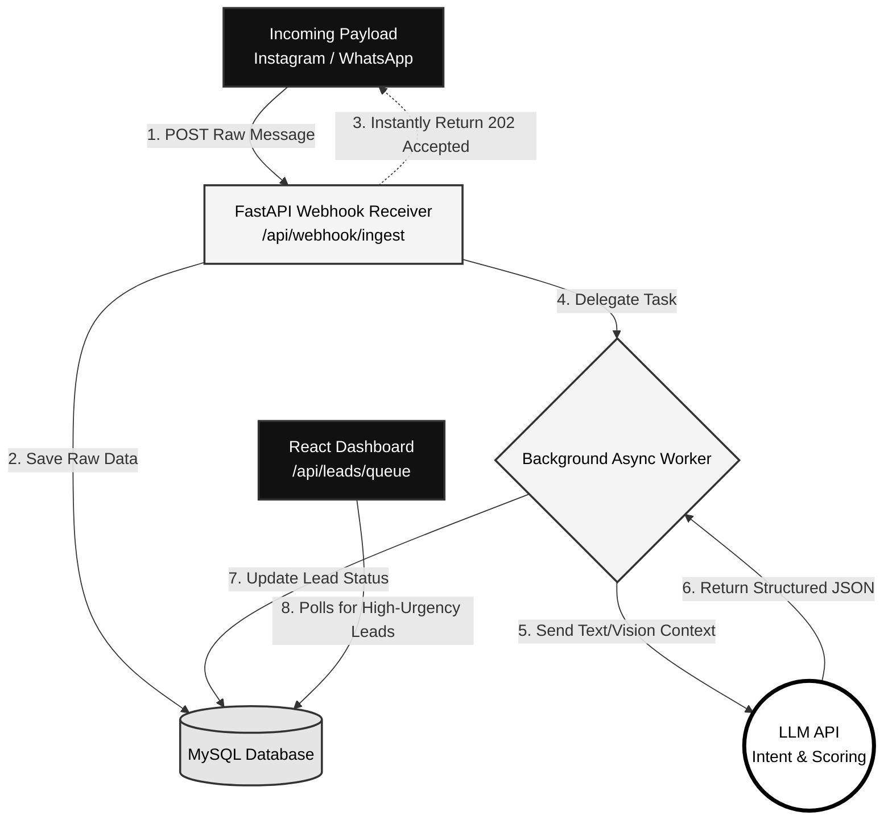

# Triage.OS - AI Lead & Message Triage Agent

A highly scalable, asynchronous Human-in-the-Loop (HITL) AI triage pipeline built for the **Catalist Media Agent Prototyping Builder Challenge**. 

This system ingests messy, cross-channel messages (WhatsApp, Instagram, web forms), processes them through an LLM to extract intent and urgency, and routes high-value or critical issues to a sleek, distraction-free React command center for human resolution.

## 🏗️ System Architecture

The architecture decouples the fast ingestion layer from the slower AI inference layer to ensure fault tolerance under heavy traffic. Drawing on architectural patterns used in edge-hardware computer vision pipelines like **CrowdEye**, the system relies on asynchronous background task delegation to ensure the main thread is never blocked.

1. **The Catch (Data Ingestion):** External webhooks hit the `/api/webhook/ingest` endpoint. The FastAPI backend instantly writes the raw payload to the database and returns a `202 Accepted` response in milliseconds, preventing third-party platform timeouts.
2. **The Brain (Background AI):** The payload is pushed to a background worker where the LLM evaluates the text (and flagged visual media), outputting strict JSON containing an `intent_category`, `urgency_score` (1-10), and a `requires_human` boolean.
3. **The Command Center (React UI):** The frontend continuously polls the queue, rendering only the prioritized, human-required leads in a high-contrast, low-cognitive-load interface.

### Data Flow Diagram



## 🚀 Tech Stack

* **Backend:** Python, FastAPI, Pydantic
* **Frontend:** React, Vite, Tailwind CSS v4
* **AI Integration:** LLM API (Mocked in prototype for localized testing)

## 🛠️ Local Installation & Setup

### 1. Start the FastAPI Backend
Ensure you have Python 3.9+ installed. Open your terminal and run:

```bash
# Navigate to your backend directory
# Install dependencies
pip install fastapi uvicorn pydantic

# Launch the server (Bypasses Windows PATH issues)
python -m uvicorn main:app --reload
```
The backend will boot up at `http://127.0.0.1:8000`.

### 2. Start the React Frontend
Open a **second** terminal window and run:

```bash
# Navigate to the frontend directory
cd frontend

# Install dependencies
npm install
npm install -D @tailwindcss/postcss

# Launch the Vite development server
npm run dev
```
The frontend dashboard will boot up at `http://localhost:5173/`.

## 🧪 How to Test the Prototype

To demonstrate the asynchronous queuing and dynamic UI updates, use the built-in Swagger UI to fire test payloads into the system.

1. Open your React dashboard at `http://localhost:5173/` and verify the queue is empty.
2. Open a new browser tab and navigate to the FastAPI Swagger UI: `http://127.0.0.1:8000/docs`
3. Expand the **`POST /api/webhook/ingest`** endpoint and click **"Try it out"**.
4. Paste the following JSON into the request body:

```json
{
  "channel": "instagram",
  "sender_id": "user_88",
  "text": "My account is locked and I am losing money!",
  "media_url": null
}
```

5. Click **Execute**. You will instantly receive a `202 Accepted` response in the Swagger UI.
6. Switch back to your React dashboard. Within 3 seconds, the new high-urgency lead will populate the queue, triggering the red "High Urgency" telemetry and updating the traffic stats.

## 👨‍💻 Author
**Shehan Fernando**
